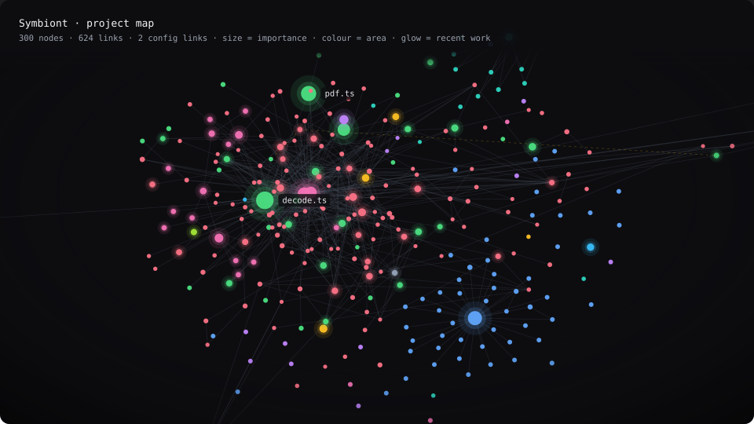

<div align="right">

[🇷🇺 Русский](#-русский) · [🇬🇧 English](#-english)

</div>

<a id="-русский"></a>
<div align="center">

# 🧬 Symbiont

### Плагин, который изучает ваш проект — и остаётся с ним

**Claude Code перестаёт быть гостем в вашем коде. Symbiont читает код и его историю, выводит собственные правила проекта и подаёт их модели в тот момент, когда они нужны. Он ничего у вас не спрашивает — он наблюдает.**

     

<br/>

*«Симбионт: живёт с проектом · подстраивается под хозяина · у каждого свой»*

</div>

<br/>

## Разница на одном примере

Одна и та же просьба в двух сессиях. Смотрите не на то, как вежливо отвечает модель, а на то, **откуда взялось знание**.

<table>
<tr>
<td width="50%" valign="top">

**Обычная сессия**

> — Добавь обработку ошибок в `payments/refund.ts`

Модель открывает файл. Потом соседний — посмотреть, как здесь принято. Потом ещё три — в поисках общего хелпера. Пишет `try/catch` с `console.error`, потому что так выглядит большинство файлов.

Но в этом проекте логирование в `catch` вычистили год назад, у ошибок свой канал, а `refund.ts` трогали одиннадцать раз за полгода — и каждый раз что-то чинили.

Вы это знаете. Модель — нет.

</td>
<td width="50%" valign="top">

**Сессия с Symbiont**

> — Добавь обработку ошибок в `payments/refund.ts`

Ещё до первой строки ответа в контексте уже лежало:

```
payments/refund.ts · вход:9 исход:4
роль: возврат платежа, единственная точка списания
от него зависят: checkout.ts, ledger.ts
менялся вместе с: ledger.test.ts (7 раз)

зона payments — хрупкая (11 fix-коммитов)
закон: пустых catch-блоков нет — 457 из 468
```

Ответ ложится в канон проекта с первого раза. Открыто файлов: **ноль**.

</td>
</tr>
</table>

Разница не в том, что модель стала умнее. Она перестала гадать.

<br/>

---

## Что он делает, пока вы работаете

Всё это происходит само — без команд и без настройки.

**Следит за контекстом вместо вас.** Знание приходит туда, где идёт работа, а не вываливается в начале: открыли файл — приходят его роль и связи; не открыли — ничего не приходит и ничего не тратится. Каждый вид подсказки ведёт учёт «подано → реально использовано», и то, что на вашем проекте не окупается, само приглушается, а позже перепроверяется — вдруг стало полезным.

**Предлагает дешёвый путь раньше дорогого.** Сейчас будет прочитан большой файл: Symbiont уже знает его роль, кто от него зависит, и — поскольку структура разобрана в фоне — каждую функцию и класс в нём с точными границами строк. Поэтому перед чтением он говорит, что знает и сколько стоит каждый путь: оглавление около 150 токенов, весь файл — тысячи. Он ничего не блокирует и ничего не решает — предложение сделано, модель берёт его или нет.

**Переживает сжатие диалога.** Когда Claude Code сжимает историю, знание о проекте обычно уходит вместе с ней — и модель снова начинает гадать. Symbiont переинжектит паспорт сразу после сжатия, а перед ним сохраняет то, что сессия успела заработать.

**Держит работу в фокусе.** К концу хода он проверяет, не расползлась ли работа: правки вышли за пределы просьбы, из диффа пропали проверки, начался непрошеный рефакторинг. Всё считается по карте связей и диффу — без единого токена. И говорит об этом как о факте, а не как о запрете: вы вполне могли расширить задачу намеренно.

**Не даёт ослабить защиту молча.** Если правка снимает валидацию, аутентификацию, проверку прав или security-заголовки — об этом сказано вслух прямо сейчас, а не на ревью через неделю.

**Сам выбирает модель под вашу подписку.** Для собственного анализа Symbiont держит очередь моделей и не пинит версии: вышла новая — берёт её. Если модель вам недоступна или её лимит исчерпан, она уходит в хвост очереди и возвращается, когда лимит сбросится. Вы этого не видите и ничего не настраиваете.

**Знает, что дорого, а что бесплатно.** Правила, карта связей, проверки и подсказки считаются на вашей машине, офлайн и даром. Модель он зовёт только когда это оправдано — в фоне и по вашей команде.

<br/>

---

## Что вы получаете

|  | |
|:--|:--|
| **Правила вашего проекта — с числами** | Не «пишите аккуратно», а «кавычки — одинарные — 182 из 182». Правила выведены из вашего кода, а не из общих представлений о хорошем коде. |
| **Карту связей** | Кто кого импортирует, что от чего зависит, какие файлы всегда меняются вместе. Работает для JS/TS, Python, PHP, Go, Java, Kotlin, C#, Rust, Ruby, C/C++, Dart, Lua. |
| **Предупреждение о хрупких местах** | «Эту зону чинили одиннадцать раз» — до правки, а не после. |
| **Защиту от тихой поломки** | Если правка снимает валидацию, аутентификацию или проверку прав — об этом сказано вслух. |
| **Знание ровно в момент нужды** | Открыли файл — приходят его роль и связи. Не открыли — ничего не приходит и ничего не тратится. |
| **Одну функцию вместо целого файла** | Структура кода проиндексирована, поэтому символ достаётся по имени — сотни токенов вместо десятков тысяч. Если файл изменился после индексации, он откажет, а не вернёт неверные строки. |

<br/>

---

## Как это выглядит

**Карта проекта.** `/symbiont:graph` собирает её в один HTML-файл и открывает в браузере: узлы таскаются мышью, размер — важность модуля, свечение — недавняя работа, цвет — часть проекта, клик раскрывает роль файла и связи в обе стороны. Ниже — проект на 1300 файлов.

<div align="center">
  
</div>

<br/>

**Ревью `/symbiont:elevate`.** Ранжированный список того, что стоит улучшить. Вот одна находка из реального прогона на этом самом репозитории (сокращено):

```yaml
ось:          целостность данных
наблюдение:   идентичность факта вычисляется как statement.split('—')[0] —
              разрез строго по длинному тире. Статистика ставит тире из
              констант в коде и всегда совпадает, но правила, выведенные
              моделью, приходят текстом: дефис вместо тире даёт ключ, равный
              всей строке. Та же мысль в другой формулировке не вытесняет
              старую запись, а создаёт вторую — и вычистить её нельзя,
              журнал append-only.
предложение:  резать по /\s[—–-]\s/ в единственном месте, где считается ключ,
              плюс разовый backfill существующих строк
эффект:       вытеснение работает независимо от того, какой символ поставила
              модель; история правила перестаёт раздваиваться
цена:         низкая · риск: средний · уверенность: 72%
опровержение: если слой 2 уже нормализует пунктуацию перед записью, дыры
              нет — только страховка от регрессии
```

Опровержение — часть вывода: предложение, которое его не пережило, до вас не доходит.

<br/>

---

## Установка

### Одно требование, которое стоит проверить первым

| | |
|---|---|
| **Рантайм** | Node **22.13+** или Bun — любой версии |
| **Проверка** | `node --version` |
| **Почему** | паспорт живёт в SQLite, а это два рантайма, у которых SQLite встроен |

Это новее собственного требования Claude Code, поэтому машина, на которой Claude Code прекрасно работает, всё равно может его не иметь.

**Если `node --version` показывает меньше 22.13** — либо поставьте свежий Node (`nvm install 22` · `winget install OpenJS.NodeJS.LTS` · `brew install node`), либо укажите Claude Code на тот, что уже есть, — `~/.claude/settings.json`:

```json
{ "env": { "PATH": "/path/to/node-22/bin:${PATH}" } }
```

На неподдерживаемом рантайме ничего не работает наполовину. Каждая команда отвечает одной строкой — что стоит на машине, что требуется и что ничего не тронуто, — а `/symbiont:status` печатает рантайм, который видит, так что гадать не о чем.

```bash
# 1. Добавить маркетплейс
claude plugin marketplace add skyproboost/symbiont

# 2. Установить плагин
claude plugin install symbiont

# 3. Перезапустить Claude Code
```

Всё. Паспорт собирается сам при первом старте сессии — от секунд до пары минут в зависимости от размера проекта. Дальше он поддерживает себя в фоне и внимания не требует.

Хотите разобрать весь проект сразу — `/symbiont:init`. Это необязательно: без него всё созреет само, просто медленнее.

<br/>

---

## Обновление

```bash
# 1. Забрать свежую версию из репозитория
claude plugin marketplace update symbiont-market

# 2. Обновить плагин
claude plugin update symbiont

# 3. Перезапустить Claude Code — без этого обновление не применится
```

**Что будет со всем, что он выучил.** Ничего — всё остаётся. Правила, карта связей, роли файлов и история живут вне плагина, в вашем каталоге данных. Обновление заменяет только код: паспорт продолжает с того места, где был, и пересобирать его не нужно.

Проверить, какая версия установлена, — `claude plugin list`.

<br/>

---

## Команды

Их намеренно мало: команда, которую надо помнить, — налог на человека. Всё существенное работает без них.

| Команда | Зачем |
|:--|:--|
| `/symbiont:status` | Что система уже знает о проекте и делает без вас: сколько правил выведено, что поймал гейт, чем занималась фоновая работа, какие подсказки здесь окупаются. Ничего не считает — только показывает.<br/>*Принимает каталог: `/symbiont:status src/core` покажет карту этой части* |
| `/symbiont:graph` | Карта проекта в браузере, и её можно трогать: узлы таскаются, размер — важность модуля, цвет — часть проекта, клик раскрывает роль файла и связи в обе стороны. Один файл, работает офлайн, кода не содержит.<br/>*Принимает каталог: `/symbiont:graph src/core` рисует только эту часть — на большом проекте читается куда лучше* |
| `/symbiont:health` | Три ответа: соблюдаются ли правила прямо сейчас, куда всё дрейфует относительно прошлых снимков и куда раз за разом ложатся починки — файлы, в которые bug-fix возвращается снова и снова. Последнее даёт кандидатов на рефакторинг, выбранных данными, а не ощущением |
| `/symbiont:init` | Разобрать проект сразу, а не ждать, пока он созреет в фоне. От секунд до пары минут. Запускайте после установки или когда хочется «изучи здесь всё».<br/>*Безопасно запускать повторно: ничего не дублируется и не переделывается — заполняется только недостающее. `/symbiont:init re` принуждает к полному пересчёту* |
| `/symbiont:charter` | Сказать словами то, что код показать не может: «прод-платежи не трогать никогда», «этот модуль заморожен намеренно», «приватность важнее скорости». То, что система уже знает, отбрасывается как избыточное; то, что действительно ваше, приходит в каждую сессию |
| `/symbiont:lang` | Язык, на котором Symbiont с вами говорит. Без аргумента сообщает действующий язык и на чём он держится; `ru` / `en` закрепляет один для этого проекта, `auto` возвращает решение наблюдению. **Русский — умолчание** — то, что вы получаете, когда ничто другое не высказалось. Влияет только на то, что говорит плагин, никогда — на ваш код |
| `/symbiont:elevate` | Ревью «что стоит улучшить и в каком порядке» — архитектура, надёжность, производительность, безопасность, данные, доступность, удобство. Каждое предложение проходит состязательную самопроверку. Ничего не меняет — это карта возможностей.<br/>*Единственная дорогая команда: думает какое-то время. Принимает порог строгости: `/symbiont:elevate 85` оставит только уверенные находки* |

<br/>

---

## Что стоит знать

**По умолчанию он говорит по-русски.** Это ответ на вопрос «что показать, пока ничего не известно», а не ограничение: Symbiont читает и язык, на котором вы пишете модели, и комментарии в коде, и документацию, и локаль системы — и сам переключается, когда они указывают в другую сторону. Английский — полноправный язык: `/symbiont:lang en` закрепляет его навсегда, `/symbiont:lang` без аргумента говорит, какой язык действует и почему. Переключается всё, что произносит плагин, — сводка, вывод команд, сообщения гейта, формулировки правил, описания MCP-инструментов. Единственное, что не переключается, — описания команд в меню `/` Claude Code: они статичны по устройству самого Claude Code и написаны по-английски.

**Ваши данные остаются на вашей машине.** Паспорт, журнал и все проекции живут в вашем каталоге данных. У Symbiont нет сервера, аккаунта, телеметрии и собственных сторонних сервисов — сам он соединений не открывает. Боевой `.env`, ключи, сертификаты и учётки пакетных менеджеров он не открывает никогда — из образцов вроде `.env.example` берутся только имена переменных; значение, похожее на секрет, в паспорт не попадает.

**«Готово» без проверки — не готово.** Если после последней правки кода не запускались тесты, линтер или тайпчек, Symbiont скажет об этом в конце хода — фактом, а в режиме блокировки не даст закрыть ход. Импорт имени, которого в файле-источнике нет, называется сразу после правки — по индексу структуры, до запуска чего-либо.

**Оглавление вместо чтения — по желанию.** По умолчанию перед чтением большого файла Symbiont лишь подсказывает, что его структура уже разобрана. Если в `gate.json` каталога данных поставить `"outline": "deny"`, первое чтение большого файла целиком отменяется, а вместо него приходит оглавление с границами строк — дальше читается нужный диапазон или, при необходимости, весь файл повторным чтением.

**Куда код всё же уходит.** Детерминированная половина — майнинг, карта связей, гейты, роли, поиск — работает полностью офлайн и сети не требует. Модельные проходы (неписаные правила, роли файлов, `/symbiont:elevate`) идут через *ваш* Claude Code и отправляют характерные образцы кода вместе с промптом — ровно туда, куда уже уходят ваши обычные диалоги. Ни отдельного канала, ни другого получателя.

**Что уезжает вместе с расшаренной сессией.** Сводка паспорта инжектится в сессию, то есть становится частью транскрипта. `/feedback`, `/bug`, `/share` и вопрос «может ли Anthropic посмотреть вашу сессию?» уносят её с собой — включая всё, что вы записали через `/symbiont:charter`. Это проза, а редактирование секретов прозу не покрывает. Стоит знать, прежде чем ответить «да» на чувствительном проекте.

**Постоянная цена — пара тысяч символов.** Дорогая часть (анализ моделью) запускается по поводу, а не постоянно; всё остальное — статистика и карта связей — считается офлайн и бесплатно.

**Это не линтер и не замена ревью.** Плагин следит за формой и за тем, чтобы правка не ослабила защиту молча. Корректность вашей логики — на вас.

<br/>

---

<div align="center">

Разработка и внутреннее устройство — [CONTRIBUTING.md](CONTRIBUTING.md) · Лицензия — [LICENSE](LICENSE)

</div>

<br/>

---

<a id="-english"></a>
<div align="center">

# 🧬 Symbiont

### The plugin that learns your project — and stays with it

**Claude Code stops being a guest in your codebase. Symbiont reads your code and its history, derives the project's own rules and hands them to the model at the moment they matter. It never asks you anything — it observes.**

     

<br/>

*“A symbiont: lives with the project · adapts to its host · unique to each one”*

</div>

<br/>

## The difference in one example

The same request in two sessions. Watch not how politely the model answers, but **where the knowledge came from**.

<table>
<tr>
<td width="50%" valign="top">

**A normal session**

> — Add error handling to `payments/refund.ts`

The model opens the file. Then a neighbouring one, to see how it's done here. Then three more, looking for a shared helper. It writes `try/catch` with `console.error`, because that's what most files look like.

But in this project logging `catch` blocks were cleaned out a year ago, errors have their own channel, and `refund.ts` was touched eleven times in six months — every time to fix something.

You know that. The model doesn't.

</td>
<td width="50%" valign="top">

**A session with Symbiont**

> — Add error handling to `payments/refund.ts`

Before the first line of the answer, the context already held:

```
payments/refund.ts · in:9 out:4
role: refund of a payment, the single charge point
depended on by: checkout.ts, ledger.ts
changed together with: ledger.test.ts (7 times)

area payments — fragile (11 fix commits)
law: no empty catch blocks — 457 of 468
```

The answer follows the project's canon on the first try. Files opened: **zero**.

</td>
</tr>
</table>

The difference isn't that the model got smarter. It's that it stopped guessing.

<br/>

---

## What it does while you work

All of this happens on its own — no commands, no configuration.

**It watches the context for you.** Knowledge arrives where the work is, instead of being dumped at the start: open a file and its role and links arrive; don't open it and nothing arrives and nothing is spent. Every kind of hint keeps a record of "surfaced → actually used", and whatever doesn't pay off on your project is dimmed automatically, then re-checked later in case it became useful.

**It offers the cheap path before the expensive one.** A big file is about to be read: Symbiont already knows its role, who depends on it, and — because the structure was parsed in the background — every function and class in it with exact line boundaries. So before the read it says what it knows and what each route costs: the outline is around 150 tokens, the whole file thousands. It blocks nothing and decides nothing — the offer is there, and the model takes it or doesn't.

**It survives conversation compaction.** When Claude Code compacts the history, knowledge about the project usually goes with it — and the model starts guessing again. Symbiont re-injects the passport right after compaction, and just before it, saves what the session earned.

**It keeps the work in focus.** Towards the end of a turn it checks whether the work has sprawled: edits reaching beyond what was asked, checks disappearing from the diff, an unrequested refactor starting. All computed from the link map and the diff — without a single token. And it says so as a fact, not a veto: you may well have widened the task on purpose.

**It won't let protection be weakened silently.** If a change removes validation, authentication, a permission check or security headers, that is said out loud right then — not at review a week later.

**It picks the model for your subscription.** For its own analysis Symbiont keeps a queue of models and pins no versions: when a newer one ships, it takes it. If a model isn't available to you or its limit is spent, it moves to the back of the queue and returns when the limit resets. You never see this and configure nothing.

**It knows what's expensive and what's free.** Rules, the link map, checks and hints are computed on your machine, offline, at no cost. It calls a model only when it's warranted — in the background and on your command.

<br/>

---

## What you get

|  | |
|:--|:--|
| **Your project's rules — with numbers** | Not "write carefully", but "quotes — single — 182 of 182". Rules are derived from your code, not from general ideas about good code. |
| **A map of connections** | Who imports whom, what depends on what, which files always change together. Works for JS/TS, Python, PHP, Go, Java, Kotlin, C#, Rust, Ruby, C/C++, Dart, Lua. |
| **A warning about fragile places** | "This area was repaired eleven times" — before the edit, not after. |
| **Protection from silent breakage** | If a change removes validation, authentication or a permission check, it is said out loud. |
| **Knowledge exactly when needed** | Open a file — its role and links arrive. Don't open it — nothing arrives and nothing is spent. |
| **One function instead of a whole file** | The structure of your code is indexed, so a single symbol can be pulled out by name — hundreds of tokens instead of tens of thousands. If the file changed after indexing, it refuses rather than hand back the wrong lines. |

<br/>

---

## What it looks like

**The project map.** `/symbiont:graph` builds it into a single HTML file and opens it in your browser: drag nodes with the mouse, size means how important a module is, glow means recent work, colour means the part of the project, a click reveals a file's role and both sides of its links. Below is a project of 1300 files.

<div align="center">
  
</div>

<br/>

**An `/symbiont:elevate` review.** A ranked list of what's worth improving. Here is one finding from a real run on this very repository (shortened):

```yaml
axis:        data integrity
observation: a fact's identity is computed as statement.split('—')[0] —
             split strictly on an em dash. Statistics produce the dash from
             constants in the code and always match, but rules inferred by a
             model arrive as text: a hyphen instead of a dash yields a key
             equal to the whole string. The same thought reworded then fails
             to supersede the old record and creates a second one — which
             cannot be cleaned up, the journal is append-only.
proposal:    split on /\s[—–-]\s/ in the single place where the key is
             computed, plus a one-off backfill of existing rows
impact:      superseding works regardless of which character the model
             produced; a rule's history stops splitting in two
cost:        low · risk: medium · confidence: 72%
refutation:  if layer 2 already normalises punctuation before writing, there
             is no hole — only a guard against regression
```

The refutation is part of the output: a proposal that doesn't survive it never reaches you.

<br/>

---

## Installation

### One requirement, worth checking first

| | |
|---|---|
| **Runtime** | Node **22.13+**, or Bun — any version |
| **Check** | `node --version` |
| **Why** | the passport lives in SQLite, and these are the two runtimes that ship SQLite built in |

This is newer than Claude Code's own requirement, so a machine that runs Claude Code happily can still be short of it.

**If `node --version` says less than 22.13**, either install a current Node (`nvm install 22` · `winget install OpenJS.NodeJS.LTS` · `brew install node`), or point Claude Code at a newer one you already have — `~/.claude/settings.json`:

```json
{ "env": { "PATH": "/path/to/node-22/bin:${PATH}" } }
```

On an unsupported runtime nothing half-runs. Every command answers in one line — what is on the machine, what is required, and that nothing was touched — and `/symbiont:status` prints the runtime it sees, so there is nothing to guess at.

```bash
# 1. Add the marketplace
claude plugin marketplace add skyproboost/symbiont

# 2. Install the plugin
claude plugin install symbiont

# 3. Restart Claude Code
```

That's it. The passport builds itself when a session first starts — from seconds to a couple of minutes depending on project size. After that it keeps itself up to date in the background and needs no attention.

Want the whole project analysed at once — `/symbiont:init`. It's optional: without it everything matures on its own, just slower.

<br/>

---

## Updating

```bash
# 1. Pull the latest version from the repository
claude plugin marketplace update symbiont-market

# 2. Update the plugin
claude plugin update symbiont

# 3. Restart Claude Code — the update doesn't apply without it
```

**What happens to everything it learned.** Nothing — it stays. Rules, the link map, file roles and history live outside the plugin, in your data directory. An update replaces code only: the passport continues from where it was and doesn't need rebuilding.

To check which version is installed — `claude plugin list`.

<br/>

---

## Commands

There are deliberately few: a command you have to remember is a tax on the human. Everything essential works without them.

| Command | What for |
|:--|:--|
| `/symbiont:status` | What the system already knows about the project and does without you: how many rules were derived, what the gate caught, what the background work has been doing, which hints pay off here. Computes nothing — only shows.<br/>*Takes a directory: `/symbiont:status src/core` shows the map of that part* |
| `/symbiont:graph` | The project map in your browser, and you can touch it: drag nodes, size means a module's importance, colour means the part of the project, a click opens a file's role and both sides of its links. One file, works offline, holds no code.<br/>*Takes a directory: `/symbiont:graph src/core` draws only that part — on a large project it reads far better* |
| `/symbiont:health` | Three answers: are the rules being followed right now, where is everything drifting compared to earlier snapshots, and where do repairs keep landing — the files bug fixes return to again and again. The last one gives refactoring candidates chosen by data, not by feeling |
| `/symbiont:init` | Analyse the project at once instead of waiting for it to mature in the background. Seconds to a few minutes. Run it after installing, or when you want "learn everything here".<br/>*Safe to run again: nothing is duplicated or redone — only what's missing is filled in. `/symbiont:init re` forces a full recount* |
| `/symbiont:charter` | Say in words what the code can't show: "never touch production payments", "this module is frozen on purpose", "privacy outweighs speed". What the system already knows is discarded as redundant; what's genuinely yours arrives in every session |
| `/symbiont:lang` | The language Symbiont speaks to you in. With no argument it tells you the language in force and what it rests on; `ru` / `en` pins one for this project, `auto` hands the decision back to observation. **Russian is the default** — it is what you get when nothing else has spoken. Affects only what the plugin says, never your code |
| `/symbiont:elevate` | A review of "what's worth improving and in what order" — architecture, reliability, performance, security, data, accessibility, usability. Every proposal goes through an adversarial self-check. Changes nothing — it's a map of options.<br/>*The one expensive command: it thinks for a while. Takes a strictness threshold: `/symbiont:elevate 85` keeps only confident findings* |

<br/>

---

## Worth knowing

**It speaks Russian by default.** That is the answer to "what to show before anything is known", not a limit: Symbiont also reads the language you write in, the comments in your code, your docs and your system locale, and switches on its own when they point the other way. English is a full citizen — `/symbiont:lang en` pins it for good, `/symbiont:lang` alone tells you which language is in force and why. Everything the plugin says switches — the summary, command output, gate messages, the wording of derived rules, MCP tool descriptions. The one thing that does not is the command descriptions in Claude Code's `/` menu: those are static by Claude Code's own design and are written in English. This documentation exists in both languages — [Русская версия](#-русский).

**Your data stays on your machine.** The passport, the journal and every projection live in your data directory. Symbiont has no server, no account, no telemetry and no third-party services of its own — it never opens a connection by itself. It never opens a production `.env`, keys, certificates or package-manager credentials — from templates such as `.env.example` it takes variable names only, and a value that looks like a secret never enters the passport.

**"Done" without a check is not done.** If no tests, linter or type check ran after the last code edit, Symbiont says so at the end of the turn — as a fact, and in blocking mode it keeps the turn open. An import of a name the source file does not declare is reported right after the edit, from the structure index, before anything runs.

**Outline instead of reading — if you want it.** By default, before a large file is read, Symbiont only notes that its structure is already parsed. Set `"outline": "deny"` in `gate.json` in the data directory and the first whole-file read of a large file is cancelled, with the outline and its line ranges delivered instead — the model then reads the range it needs, or the whole file by repeating the read.

**Where code does go.** The deterministic half — mining, the link map, gates, roles, search — runs fully offline and needs no network at all. The model passes (unwritten rules, file roles, `/symbiont:elevate`) run through *your* Claude Code and send representative code samples along with the prompt, to exactly the place your ordinary conversations already go. No separate channel and no other recipient.

**What travels with a shared session.** The passport summary is injected into the session, so it is part of the transcript. `/feedback`, `/bug`, `/share` and the "can Anthropic look at your session?" prompt carry it along — including whatever you recorded with `/symbiont:charter`. That is prose, and secret redaction does not cover prose. Worth knowing before you answer Yes on a sensitive project.

**The standing cost is a couple of thousand characters.** The expensive part (analysis by a model) is triggered, not constant; everything else — statistics and the link map — runs offline and for free.

**It's not a linter and not a replacement for review.** The plugin watches form and makes sure a change doesn't weaken protection silently. The correctness of your logic is on you.

<br/>

---

<div align="center">

Development and internals — [CONTRIBUTING.md](CONTRIBUTING.md) · License — [LICENSE](LICENSE)

</div>
